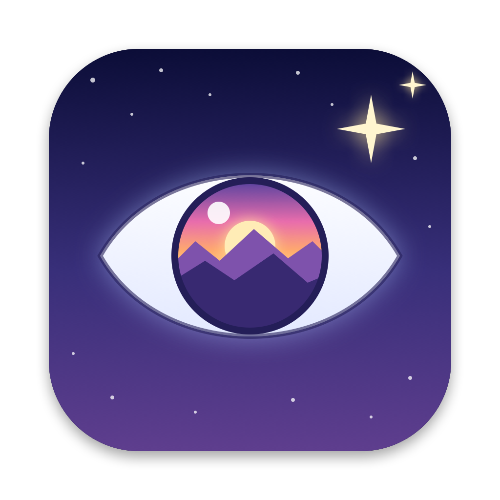
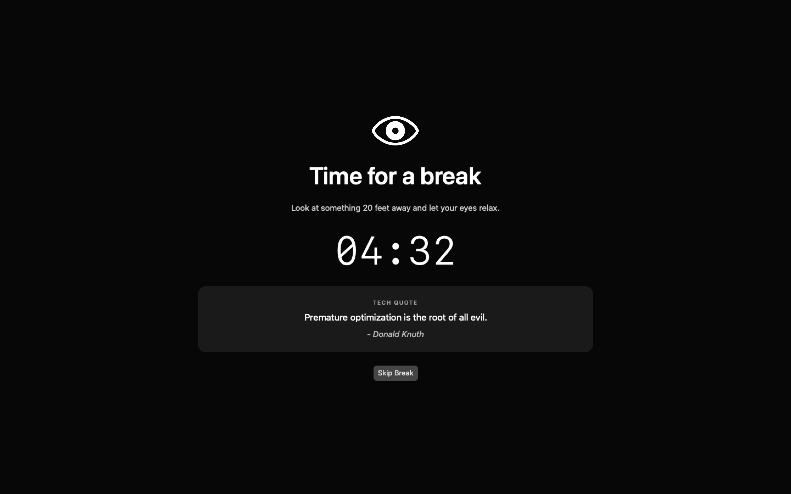
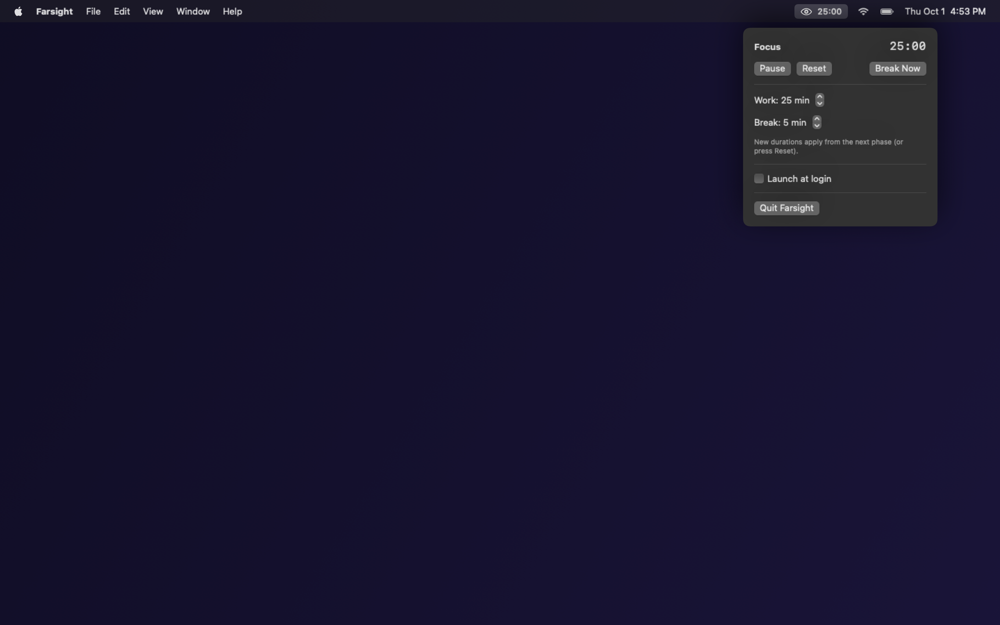
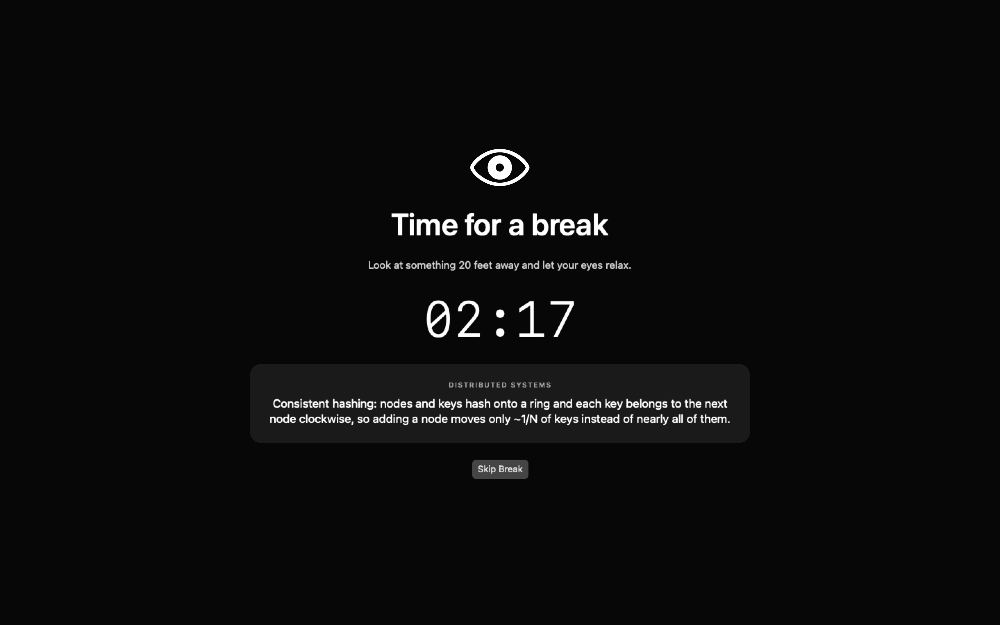

<p align="center">
  
</p>

# Farsight

*Look far away, come back with an insight.*

<p align="center">
  <a href="https://akgarhwal.github.io/farsight/"><strong>🌐 Visit Official Website & Live Demo</strong></a>
</p>

A tiny macOS menu bar app that reminds you to rest your eyes. It alternates a
work timer (default **25 min**) with a break (default **5 min**). During a break
a full-screen overlay covers every display until the break ends or you skip it.

<p align="center">
  
</p>

<p align="center">
  
</p>

<p align="center">
  
</p>

<sub>Screenshots are rendered from the app's own views by `./screenshots.sh`.</sub>

- Each break shows a random card from 1,000+ quotes and learning tips: tech and
  travel quotes, tech tips, system design, distributed systems, algorithms,
  GenAI and AI agents (edit or add files in `Resources/Tips/*.json`)
- Live countdown in the menu bar
- Opening Farsight while it's running (Spotlight, Finder) shows its controls under the
  menu bar, for when a crowded menu bar hides the icon behind the notch
- Start / Pause / Reset / Break Now / Skip Break
- Configurable work and break durations (saved between launches)
- Launch at login toggle
- Universal binary: Apple Silicon and Intel, macOS 13 Ventura or newer
- Locking the screen or sleeping the Mac freezes the timer. Away for at least one
  break (or the rest of the current break) starts a fresh work cycle on return;
  a shorter absence resumes where it left off. A manual pause stays paused.

## Install on any Mac

### Option 1: Quick Install via Terminal (Recommended)

Run this one-liner in Terminal to automatically download the latest release, install to `/Applications`, clear Gatekeeper quarantine, and launch:

```bash
curl -fsSL https://akgarhwal.github.io/farsight/install.sh | bash
```

### Option 2: Download DMG

1. Download **[Farsight.dmg](https://github.com/akgarhwal/farsight/releases/latest/download/Farsight.dmg)** from the [latest release](https://github.com/akgarhwal/farsight/releases/latest).
2. Open the disk image and double-click **Install Farsight.command** (or drag `Farsight.app` to `/Applications`).
3. Click the eye icon in the menu bar and turn on **Launch at login**.

### "Farsight can't be opened" / "unidentified developer"

The app is signed ad-hoc, not with an Apple Developer ID, so it isn't notarized.
The install script handles this by clearing the quarantine flag. If you dragged
the app to Applications by hand instead, either:

- run `xattr -cr /Applications/Farsight.app` in Terminal, or
- try to open it once, then go to **System Settings → Privacy & Security** and
  click **Open Anyway**.

If macOS blocks `Install Farsight.command` itself, run it from Terminal:
`bash "/Volumes/Farsight/Install Farsight.command"`.

## Build from source

If you'd rather not run a prebuilt app from someone else, build your own. A
build takes about 30 seconds. The whole app is about 500 lines of Swift in
`Sources/Farsight/`, with no network access and no third-party dependencies, so
it's quick to read first.

### Prerequisites

- macOS 13 Ventura or newer
- Xcode Command Line Tools, which provide `swiftc`, `lipo` and `codesign`. Full
  Xcode is not required. Check whether you already have them:

  ```bash
  xcode-select -p   # prints a path if installed
  swiftc --version  # tested with Swift 6.1
  ```

  If not, install them (a system dialog opens; about 5 minutes):

  ```bash
  xcode-select --install
  ```

Everything else (`hdiutil`, `xattr`, `PlistBuddy`) ships with macOS.

### Steps

1. Get the source: clone the repository, or copy the `farsight` folder to the Mac.
2. Build it:

   ```bash
   cd farsight
   ./build.sh
   ```

   This creates `dist/Farsight.app` and `dist/Farsight.dmg`, and ends with a line
   showing both architectures (`x86_64 arm64`).
3. Optionally run the tests: `./test.sh` should end with `All tests passed`.
4. Install and launch it:

   ```bash
   ./install.sh
   ```

   This quits any running Farsight, copies the new build to `/Applications` (or
   `~/Applications`), and opens it. A build you made yourself has no download
   quarantine, so macOS won't show the "unidentified developer" warning.

To update later, get the new source and repeat steps 2 and 4.

### Other scripts

```bash
./screenshots.sh  # regenerates docs/*.png after UI changes
./icon.sh         # regenerates Resources/AppIcon.icns from tools/Icon.swift
```

`build.sh` compiles arm64 and x86_64 separately with `swiftc`, merges them with
`lipo`, and ad-hoc signs the bundle (Apple Silicon won't run unsigned code).

### Build troubleshooting

- **`xcrun: error: invalid active developer path`**: the Command Line Tools
  are missing or broken. Run `xcode-select --install`.
- **`redefinition of module 'SwiftBridging'`**: a known issue after some
  Command Line Tools updates. All scripts (`build.sh`, `test.sh`, `screenshots.sh`, `icon.sh`)
  work around it automatically via `tools/setup-overlay.sh`.
- **Two Farsight entries in Spotlight**: one is the build output in `dist/`.
  Open the one in Applications.

## Uninstall

Turn off **Launch at login**, quit Farsight, then delete `Farsight.app`.
Settings are stored in `defaults read com.a0004.farsight`.
